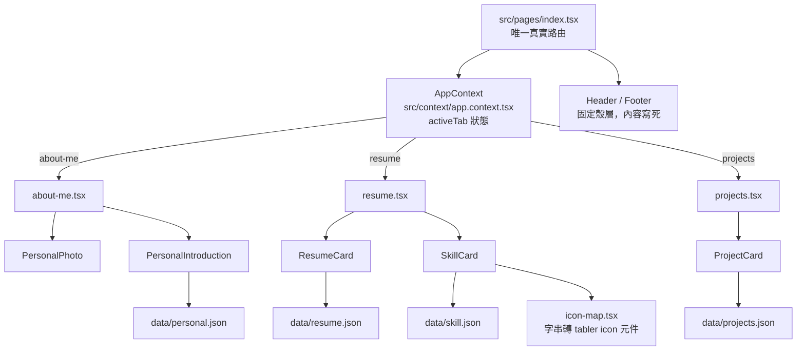

# CLAUDE.md

This file provides guidance to Claude Code (claude.ai/code) when working with code in this repository.

## 專案概述

個人履歷 / CV 網站（Sokuo，Frontend Engineer），使用 Next.js + TypeScript + SCSS 打造，以靜態匯出方式部署到 GitHub Pages：https://sokuo1748.github.io/cv

## 常用指令

```bash
yarn dev      # 啟動開發伺服器 http://localhost:3000
yarn build    # next build（靜態匯出到 out/）
yarn lint     # eslint
```

目前沒有測試框架、沒有測試指令。部署已改為 push 到 `main` 後由 GitHub Actions 自動 build 並發布到 GitHub Pages（見下方「部署流程」），不需要再手動執行部署指令。

## 專案架構

**靜態匯出＋前端自己控制的「分頁路由」。** `next.config.ts` 設定 `output: 'export'`、`basePath: '/cv'`、`assetPrefix: '/cv/'`（因為網站部署在 GitHub Pages 的 project page 路徑下，不是網域根目錄）、`images.unoptimized: true`。雖然用的是 Next.js Pages Router，但整個網站實際上只有一個真正的路由：`src/pages/index.tsx` 不會做真正的頁面跳轉，而是透過 `AppContext`（`src/context/app.context.tsx`）裡的 `activeTab` 狀態，切換渲染 `AboutMe` / `Resume` / `Projects` 三個分頁內容，切換時搭配 500ms 的淡入淡出（`isTransitioning`）。合法的分頁 id 定義在該檔案的 `APP_TAB_IDS`。

**內容資料與畫面分離。** 所有履歷內容都放在 `src/data/*.json`，元件/頁面單純負責渲染。之後要更新履歷內容（工作經歷、技能、作品、自我介紹文字），只需要編輯對應的 json，不需要動 `.tsx`。

**元件慣例。** `src/components/` 底下每個元件都搭配一個同名的 `.module.scss`（CSS Modules），以 `styles` 匯入、`styles.xxx` 使用。

**Path alias。** `@/*` 對應 `./src/*`（見 `tsconfig.json`）。

### 架構圖



### 內容對應表

| 分頁 | 頁面檔案 | 使用元件 | 資料來源 |
|------|----------|----------|----------|
| about-me | `src/pages/about-me/about-me.tsx` | `PersonalPhoto`、`PersonalIntroduction`（`src/components/personal-photo/`、`personal-introduction/`） | `src/data/personal.json` |
| resume | `src/pages/resume/resume.tsx` | `ResumeCard`、`SkillCard`（`src/components/resume-card/`、`skill-card/`） | `src/data/resume.json`（工作經歷）、`src/data/skill.json`（技能，icon 名稱經 `src/components/icon-map/icon-map.tsx` 轉成實際圖示） |
| projects | `src/pages/projects/projects.tsx` | `ProjectCard`（`src/components/project-card/`） | `src/data/projects.json` |
| （固定殼層，非分頁） | `src/pages/index.tsx` | `Header`（`src/components/headers/`）、`Footer`（`src/components/footers/`） | 無，內容寫死在元件內 |

## 部署流程

透過 GitHub Actions（`.github/workflows/deploy.yml`）自動部署，push 到 `main` 就會觸發：

1. `yarn install` → `yarn build`（`next build`，因 `output: 'export'` 會產生靜態檔案到 `out/`）
2. `actions/upload-pages-artifact` 打包 `out/` 目錄（會自動跳過 Jekyll 處理，不需要手動加 `.nojekyll`）
3. `actions/deploy-pages` 部署到 GitHub Pages

GitHub repo 端需要在 **Settings → Pages → Build and deployment → Source** 設定為 **GitHub Actions**（一次性設定）。`next.config.ts` 的 `basePath`/`assetPrefix: '/cv'` 仍然維持不變，因為網站路徑沒有變。

## 目前限制

- 沒有測試框架，也沒有 CI 檢查（lint 目前不是自動跑的），改動後建議手動 `yarn dev` 確認畫面
- Git 分支慣例：`feature/xxx`、`bug/xxx`
